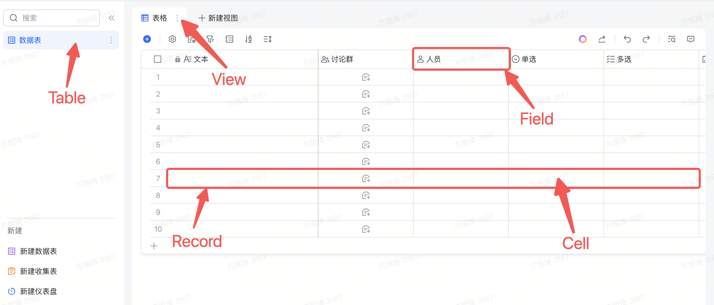
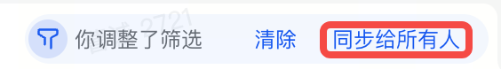

# View Module

A `View` is a presentation of a data `Table` (such as the display order of fields/records, visibility, etc.), a data table has at least one view, possibly multiple views, each view has a unique identifier viewId, viewId is unique in a multi-dimensional table.

::: tip
Note the difference here with the Table module. In the View module, the order of fields/records is **ordered**.
:::

The `View` module can be obtained in the `Table` layer via the `getViewById` method:

```typescript
const view = await table.getViewById(viewId);
```

View can be seen through the following figure as responsible for the UI display on the page, so many APIs related to the UI display format exist in the View layer, such as filtering/grouping/sorting, etc.


::: warning
In the View layer, many interfaces, such as grouping/filtering/sorting, etc., need to call the `view.applySetting` method if you need to save or synchronize with other users after calling the API.
:::

## Different types of views
Currently, 6 different types of views are supported, and the available capabilities of different types of views vary:

- [GridView](./view/grid.md): Table view
- [KanbanView](./view/kanban.md): Kanban view
- [FormView](./view/form.md): Form view
- [GalleryView](./view/gallery.md): Gallery view
- [GanttView](./view/gantt.md): Gantt view
- [CalendarView](./view/calendar.md): Calendar view


## View basic abilities

The most basic capabilities in the view include `filtering`, `sorting` and `grouping`. Their usage will be introduced below. The relevant APIs are defined in specific types of modules, such as [GridView](./view/grid.md).

### Filter
The view filters out records that meet the conditions in the data table based on the filtering conditions, and is mainly composed of two parts of information: `FilterInfoCondition` and `FilterConjunction`

```typescript
interface IFilterInfo {
  conjunction: FilterConjunction;
  conditions: FilterInfoCondition[];
}
```

#### FilterInfoCondition

`FilterInfoCondition` represents the filter condition. Each Condition consists of three basic elements: `field` + `filter operator` + `matching value`.


```typescript
interface FilterInfoCondition {
  fieldId: string; // field unique identifier
  conditionId?: string; // condition is a unique identifier, which does not need to be passed in when adding a new one.
  value: FieldValue;  // Field match value
  operator: FilterOperator; // match operator
}
```

#### FilterConjunction

Among them, `FilterConjunction` represents the effective condition of the filter condition, `FilterConjunction.And` represents that all filter conditions are met, and `FilterConjunction.Or` represents that any filter condition is met:

```typescript
enum FilterConjunction {
  And = 'and',
  Or = 'or'
}
```


Different fields can match different filter operators and matching values. The specific types are as follows:

|              | IFilterAttachmentCondition                            | IFilterCheckboxCondition | IFilterAutoNumberCondition                                                                                                                                                                                              | IFilterDateTimeCondition                                                                                                        | IFilterCreatedTimeCondition                                                                                                     | IFilterModifiedTimeCondition                                                                                                     | IFilterUserCondition | IFilterCreatedUserCondition | IFilterModifiedUserCondition | IFilterDuplexLinkCondition | IFilterSingleLinkCondition | IFilterFormulaCondition | IFilterGroupChatCondition | IFilterLocationCondition | IFilterLookupCondition | IFilterMultiSelectCondition  | IFilterSingleSelectCondition                                                                                                                                   | IFilterPhoneCondition | IFilterTextCondition | IFilterNumberCondition                                                                                                                                                                                                 | IFilterUrlCondition  | IFilterCurrencyCondition                                                                                                                                                                                               | IFilterBarcodeCondition | IFilterProgressCondition                                                                                                                                                                                               | IFilterRatingCondition                                                                                                                                                                                                 |
| ------------ | ----------------------------------------------------- | ------------------------ | ----------------------------------------------------------------------------------------------------------------------------------------------------------------------------------------------------------------------- | ------------------------------------------------------------------------------------------------------------------------------- | ------------------------------------------------------------------------------------------------------------------------------- | -------------------------------------------------------------------------------------------------------------------------------- | -------------------- | --------------------------- | ---------------------------- | -------------------------- | -------------------------- | ----------------------- | ------------------------- | ------------------------ | ---------------------- | ---------------------------- | -------------------------------------------------------------------------------------------------------------------------------------------------------------- | --------------------- | -------------------- | ---------------------------------------------------------------------------------------------------------------------------------------------------------------------------------------------------------------------- | -------------------- | ---------------------------------------------------------------------------------------------------------------------------------------------------------------------------------------------------------------------- | ----------------------- | ---------------------------------------------------------------------------------------------------------------------------------------------------------------------------------------------------------------------- | ---------------------------------------------------------------------------------------------------------------------------------------------------------------------------------------------------------------------- |
| **operator** | `FilterOperator.IsEmpty \| FilterOperator.IsNotEmpty` | `FilterOperator.Is`      | `FilterOperator.Is \| FilterOperator.IsNot \| FilterOperator.IsGreater \| FilterOperator.IsGreaterEqual \| FilterOperator.IsLess \| FilterOperator.IsLessEqual \| FilterOperator.IsEmpty \| FilterOperator.IsNotEmpty;` | `FilterOperator.Is \| FilterOperator.IsGreater \| FilterOperator.IsLess \| FilterOperator.IsEmpty \| FilterOperator.IsNotEmpty` | `FilterOperator.Is \| FilterOperator.IsGreater \| FilterOperator.IsLess \| FilterOperator.IsEmpty \| FilterOperator.IsNotEmpty` | `FilterOperator.Is  \| FilterOperator.IsGreater \| FilterOperator.IsLess \| FilterOperator.IsEmpty \| FilterOperator.IsNotEmpty` | `BaseFilterOperator` | `BaseFilterOperator`        | `BaseFilterOperator`         | `BaseFilterOperator`       | `BaseFilterOperator`       | `FilterOperator`        | `BaseFilterOperator`      | `BaseFilterOperator`     | `FilterOperator`       | `BaseFilterOperator`         | `FilterOperator.Is \| FilterOperator.IsNot \| FilterOperator.Contains \| FilterOperator.DoesNotContain \| FilterOperator.IsEmpty \| FilterOperator.IsNotEmpty` | `BaseFilterOperator`  | `BaseFilterOperator` | `FilterOperator.Is \| FilterOperator.IsNot \| FilterOperator.IsGreater \| FilterOperator.IsGreaterEqual \| FilterOperator.IsLess \| FilterOperator.IsLessEqual \| FilterOperator.IsEmpty \| FilterOperator.IsNotEmpty` | `BaseFilterOperator` | `FilterOperator.Is \| FilterOperator.IsNot \| FilterOperator.IsGreater \| FilterOperator.IsGreaterEqual \| FilterOperator.IsLess \| FilterOperator.IsLessEqual \| FilterOperator.IsEmpty \| FilterOperator.IsNotEmpty` | `BaseFilterOperator`    | `FilterOperator.Is \| FilterOperator.IsNot \| FilterOperator.IsGreater \| FilterOperator.IsGreaterEqual \| FilterOperator.IsLess \| FilterOperator.IsLessEqual \| FilterOperator.IsEmpty \| FilterOperator.IsNotEmpty` | `FilterOperator.Is \| FilterOperator.IsNot \| FilterOperator.IsGreater \| FilterOperator.IsGreaterEqual \| FilterOperator.IsLess \| FilterOperator.IsLessEqual \| FilterOperator.IsEmpty \| FilterOperator.IsNotEmpty` |
| **value**    | `null `                                               | `boolean \| null`        | `number \| null`                                                                                                                                                                                                        | `IFilterDateTimeValue = number \| FilterDuration  \| null`                                                                      | `number \| FilterDuration \| null`                                                                                              | `number \| FilterDuration \| null`                                                                                               | `string[] \| null`   | `string[] \| null`          | `string[] \| null`           | `string[] \| null`         | `string[] \| null`         | `IFilterAll`            | `string[] \| null`        | `string \| null`         | `IFilterAll`           | `string[] \| null \| string` | `string[] \| string`                                                                                                                                           | `string \| null`      | `string \| null`     | `number \| null`                                                                                                                                                                                                       | `string \| null`     | `number \| null`                                                                                                                                                                                                       | `string \| null`        | `number \| null`                                                                                                                                                                                                       | `number \| null`                                                                                                                                                                                                       |

The `FilterOperator` is defined as follows:

```typescript
enum FilterOperator {
  /** Equal */
  Is = 'is',
  /** Not equal */
  IsNot = 'isNot',
  /** Contains */
  Contains = 'contains',
  /** Does not contain */
  DoesNotContain = 'doesNotContain',
  /** Is empty */
  IsEmpty = 'isEmpty',
  /** Is not empty */
  IsNotEmpty = 'isNotEmpty',
  /** Greater than */
  IsGreater = 'isGreater',
  /** Greater than or equal to */
  IsGreaterEqual = 'isGreaterEqual',
  /** Less than */
  IsLess = 'isLess',
  /** Less than or equal to */
  IsLessEqual = 'isLessEqual'
}
```

`FilterDuration` is defined as follows:

```typescript
enum FilterDuration {
  /** Today */
  Today = "Today",
  /** Tomorrow */
  Tomorrow = "Tomorrow",
  /** Yesterday */
  Yesterday = "Yesterday",
  /** Past 7 days */
  TheLastWeek = "TheLastWeek",
  /** Next 7 days */
  TheNextWeek = "TheNextWeek",
  /** Past 30 days */
  TheLastMonth = "TheLastMonth",
  /** Next 30 days */
  TheNextMonth = "TheNextMonth",
  /** Current week */
  CurrentWeek = "CurrentWeek",
  /** Last week */
  LastWeek = "LastWeek",
  /** Current month */
  CurrentMonth = "CurrentMonth",
  /** Last month */
  LastMonth = "LastMonth"
}
```

`BaseFilterOperator` is defined as follows:

```typescript
type BaseFilterOperator =
  FilterOperator.Is
  | FilterOperator.IsNot
  | FilterOperator.Contains
  | FilterOperator.DoesNotContain
  | FilterOperator.IsEmpty
  | FilterOperator.IsNotEmpty;
```

### Sort
The view sorts the records in the data table according to certain rules. A sorting rule consists of `field ID` + `order`:

```typescript
interface ISortInfo {
  fieldId: string;
  /** false: Ascending A -> Z;  true: Descending Z -> A */
  desc: boolean;
}
```

### Group
Views group records in the data table according to certain rules. A grouping rule consists of `field ID` + `order`:


```typescript
interface IGroupInfo {
  fieldId: string;
  /** false: Ascending A -> Z;  true: Descending Z -> A */
  desc: boolean;
}
```

### Apply Settings
::: warning
For grouping/filtering/sorting capabilities in the View module, after calling the write API, if you want to save or synchronize to other users, you need to call the `applySetting` method
:::

