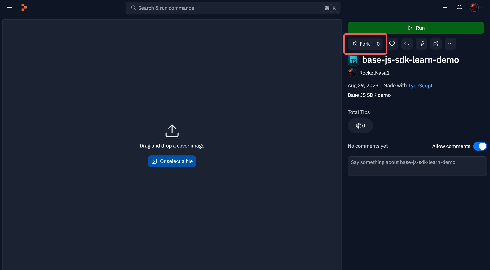
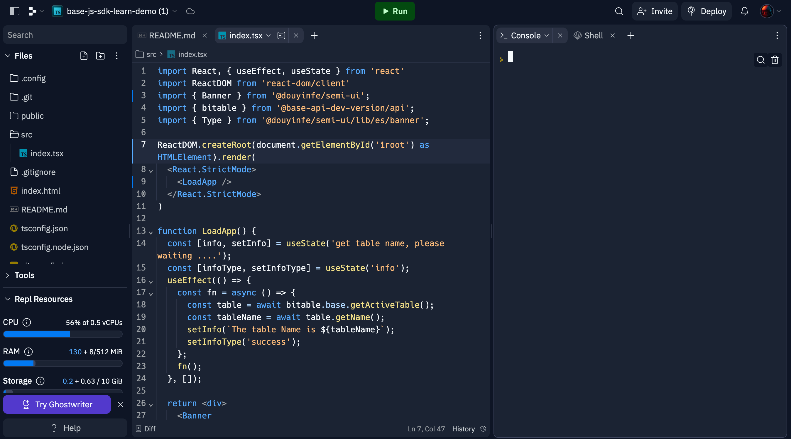
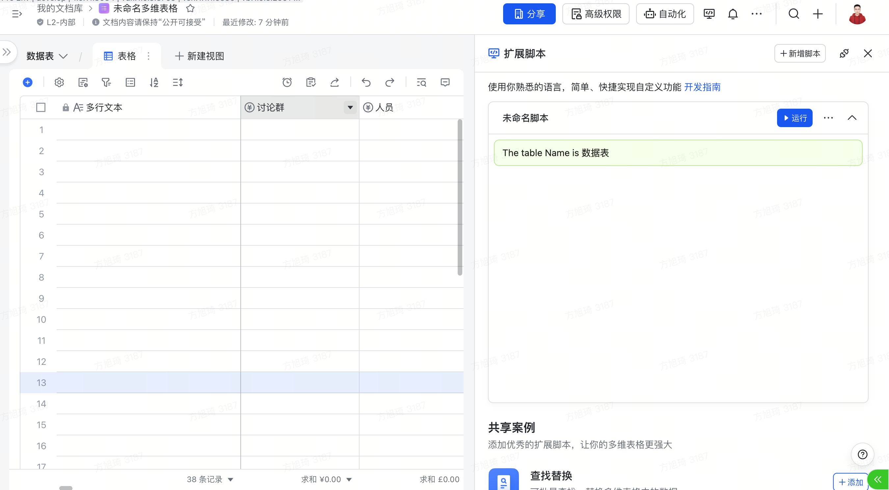
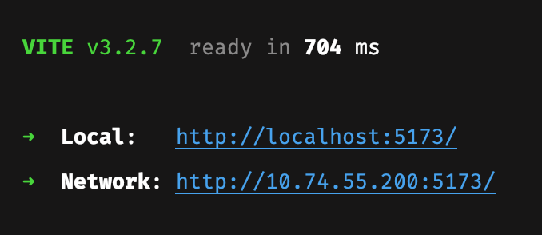
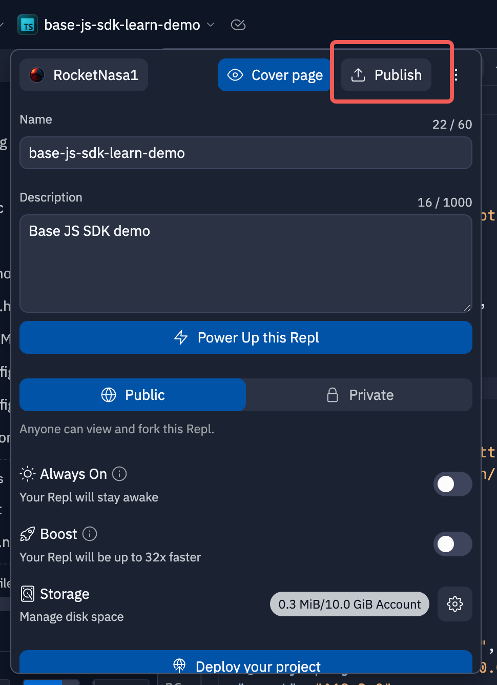
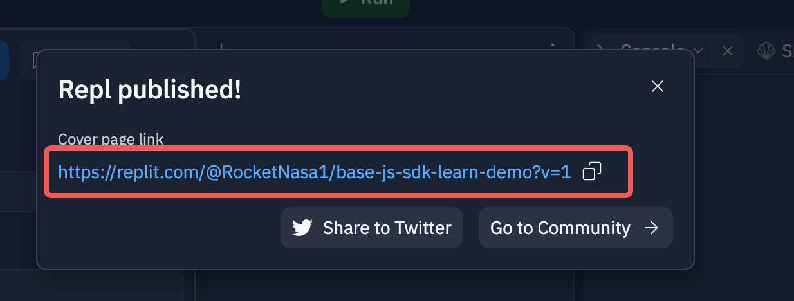
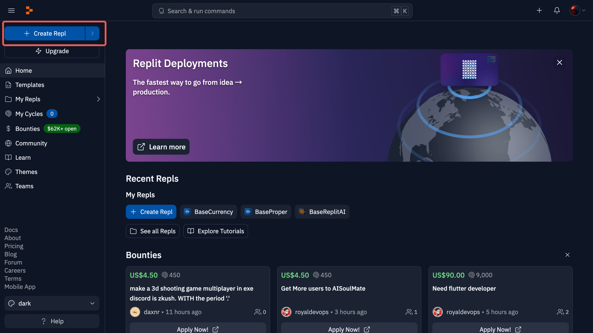
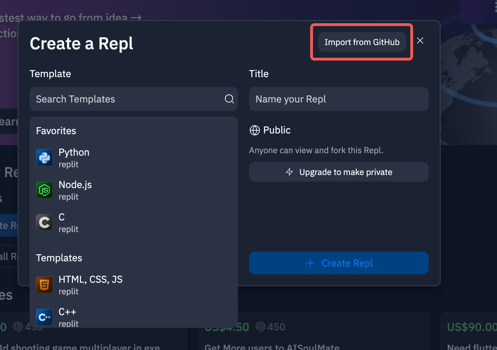

# Quick Start

Welcome to the Base JS SDK documentation! This section will introduce you to how to develop a Base plugin and master 80% of the concepts and core concepts of Base plugin development.
## Upgrading from the old version:
````shell
# npm
npm update @lark-base-open/js-sdk@0.3.0-alpha
# yarn
yarn upgrade @lark-base-open/js-sdk@0.3.0-alpha
# pnpm 
pnpm update @lark-base-open/js-sdk@0.3.0-alpha
````

## Package download:
```shell
# npm
npm install @lark-base-open/js-sdk@0.3.0-alpha
# yarn
yarn add @lark-base-open/js-sdk@0.3.0-alpha
# pnpm 
pnpm add @lark-base-open/js-sdk@0.3.0-alpha
```
[NPM address](https://www.npmjs.com/package/@lark-base-open/js-sdk)

Prerequisites:
+ Basic knowledge of front-end development: HTMl / CSS / JS
+ [React](https://reactjs.org/tutorial/tutorial.html)

Recommended learning:
+ [TypeScript](https://www.typescriptlang.org/docs/)

## Prepare the development environment
Currently, we provide two development methods for beginners who have just started:
1. Development on the Replit official website (recommended for new users)
2. Development in a local editor (recommended for users with some programming experience)
### Development on the Replit official website
1. Click to enter this [Replit project](https://replit.com/@RocketNasa1/js-sdk-learn-demo?v=1)
2. Fork this repository (click the Fork button displayed in the red box)
   
3. Enter a name and description you like, and then click the Fork Repl button in the lower right corner.
   
4. Wait a moment, and you will enter a page like the following. Click the Run button at the top, wait a moment, and Replit will run the project.
   
5. At this time, a preview effect will be displayed on the right, and there will also be a URL address. Copy this URL address.
   
6. Open/create a Feishu spreadsheet, click the extension script button here
   
7. Click "Add new script", paste the URl copied in step 5, and then click "OK"
   
8. After completing the confirmation popup in step 7, the base will start to load the corresponding plugin. After the loading is complete, the effect will be displayed as follows (sometimes due to network and deployment reasons, the deployment is slow, and you need to wait patiently. After the plugin is officially launched, this problem will not occur.)
   
   The function of this plugin is to get the name of the current table and display it. Later, based on this basic demo, we will implement a currency conversion plugin.
### Local development
1. Click to enter this [Github project](https://github.com/Lark-Base-Team/js-sdk-learn-demo), Fork this repository, and git clone it locally
2. Follow the content of the Readme.md file in the project to run the project, and copy the corresponding URL as prompted. For example, the address in the figure below:



3. Open/create a Feishu spreadsheet, click the extension script button here
   
4. Click "Add new script", paste the URl copied in step 2, and then click "OK"
   
5. After completing the confirmation popup in step 4, the base will start to load the corresponding plugin. After the loading is complete, the effect will be displayed as follows.
   
6. The function of this plugin is to get the name of the current table and display it. Later, based on this basic demo, we will implement a currency conversion plugin.
## Core Knowledge
On the basis of preparing the development environment, let us first understand the core concepts and related knowledge of bases.

The following figure shows the API design model:


``bitable`` is the entry point of the API, and modules such as ``base`` are mounted as attributes on it. Among them, ``base`` is the module for obtaining ``table``, and most of the APIs are derived from ``table``. Generally, we use it in this way in the project:

```typescript 
import { bitable } from '@lark-base-open/js-sdk'
const base = bitable.base;
const table = await base.getActiveTable();
const ui = bitable.ui;
const bridge = bitable.bridge;
```

The following introduces the concepts of each module:

+ ``base``: The ``base`` module can be understood as a collection of multiple ``tables``, and the API can be used to obtain the corresponding ``table``. In addition, there are application-level APIs such as file uploading in ``base`` module.

+ ``table``: The ``table`` module is a collection of data and does not involve the display of the ``UI`` on the page. Its concept is similar to that of a table in a database: it contains ``field`` and ``record``, and in bases, the ``table`` also has the concept of ``view`` (when the ``field`` information is obtained at the ``table`` level, it is often unordered because the ``table`` level only has data without knowing its display in the ``view`` layer).

+ ``field``: The ``field`` module includes many different types of fields, such as ``IAttachmentField`` and the later ``ICurrencyField`` we need to use. The ``Field`` field refines many methods of field operation and setting field attributes, such as providing a method to add options for multi-select/single-select fields. Detailed methods can be found in the corresponding API documentation. At the same time, we also recommend that users start with fields and combine them with ``record`` to add, delete, modify, query data, obtain the ``cell`` of the ``table``, or create a ``cell`` through the ``createCell`` method.

+ ``record``: The ``record`` module is mainly used to obtain data, and it can work with ``field`` to obtain the ``cell`` of a certain cell in ``field``.

+ ``cell``: The ``cell`` module represents a cell in a record/field. It supports users to create a cell by calling the ``createCell`` method of a ``field``. Once a cell is created, it can be passed as a parameter to the ``table.addRecord`` method to add a new record. When calling the ``createCell`` method, the data structure is simplified for developers' convenience. After a cell is inserted into the ``table``, it is automatically associated with a record. Once associated with a record, the ``getValue/setValue`` methods of the cell are linked to the data of the ``table``, providing real-time data updates.

+ ``view``: The ``view`` module represents the view layer, which determines the display format (order/visibility) of ``fields`` and ``records`` in the table or kanban view. When retrieving field or record information from the ``view`` layer, the information is usually consistent with the current display format (the ``table`` layer cannot determine the display format).

+ ``ui``: The ``ui`` module is responsible for the API of the plugin's display window UI, which is related to the application's capabilities.

+ ``bridge``: The ``bridge`` module mainly provides interface for the application layer, such as theme switching event notification, and other plugin capabilities related to the UI.

Now, let's implement a currency conversion plugin.

## Implementing a Currency Conversion Plugin
Assuming that you have set up the development environment, we can now develop a currency conversion plugin. First, the user needs to insert a currency field and populate it with some data.

1. After the installation is complete, create a new ts file named ``exchange-api.ts`` in the src directory and copy the following content:

```typescript
import axios from 'axios';

interface ExchangeRatesResponse {
  rates: {
    [key: string]: number;
  };
  base: string;
  date: string;
}

export async function getExchangeRate(base: string, target: string): Promise<number | undefined> {
  try {
    const response = await axios.get<ExchangeRatesResponse>(`https://api.exchangerate-api.com/v4/latest/${base}`);
    const rate = response.data.rates[target];

    if (!rate) {
      throw new Error(`Exchange rate not found for target currency: ${target}`);
    }

    return rate;
  } catch (error) {
    console.info(`Error fetching exchange rate: ${(error as any).message}`);
  }
}
```

This code is responsible for fetching real-time exchange rates. The ``base`` parameter represents the current currency type, and the ``target`` parameter represents the currency type to be converted. This API can provide exchange rates rounded to two decimal places.

2. Create a new ts file named ``const.ts`` in the src directory and copy the following content:

```typescript
import { CurrencyCode } from '@lark-base-open/js-sdk';

export const CURRENCY = [
  { label: 'CNY', value: CurrencyCode.CNY },
  { label: 'USD', value: CurrencyCode.USD },
  { label: 'EUR', value: CurrencyCode.EUR },
  { label: 'AED', value: CurrencyCode.AED },
  { label: 'BRL', value: CurrencyCode.BRL },
  { label: 'CAD', value: CurrencyCode.CAD },
  { label: 'CHF', value: CurrencyCode.CHF },
  { label: 'HKD', value: CurrencyCode.HKD },
  { label: 'INR', value: CurrencyCode.INR },
  { label: 'JPY', value: CurrencyCode.JPY },
  { label: 'MXN', value: CurrencyCode.MXN },
];
```

This file enumerates the currency types that can be converted. Since this is just a demo, the number of options is limited.

3. Provide the capability for users to select a currency field for conversion.

To enable currency conversion, we need to filter the currency type fields in the current ``table`` to allow users to select a field for conversion. Here, we will use the ``Select`` component to implement this interaction, where each option represents a currency field that can be selected in the current ``table``.

Modify the ``LoadApp`` function in ``index.tsx``:

Define the currency field information as ``currencyFieldMetaList``, the selected field ID as ``selectFieldId``, and the selected currency as ``currency``.

```typescript
import { bitable } from '@lark-base-open/js-sdk'; //[!code --]
import { bitable, CurrencyCode, FieldType, ICurrencyField, ICurrencyFieldMeta } from '@lark-base-open/js-sdk'; //[!code ++]
import { CURRENCY } from './const'; //[!code ++]

function LoadApp() {
  const [info, setInfo] = useState('get table name, please waiting ....'); // [!code --]
  const [infoType, setInfoType] = useState('info'); // [!code --]
  const [currencyFieldMetaList, setMetaList] = useState<ICurrencyFieldMeta[]>([]) // [!code ++]
  const [selectFieldId, setSelectFieldId] = useState<string>(); // [!code ++]
  const [currency, setCurrency] = useState<CurrencyCode>(); // [!code ++]
```

Modify the ``useEffect`` function to retrieve the currency field information from the current ``table`` when the page is rendered.

```typescript
useEffect(() => {
  const fn = async () => {
    const table = await bitable.base.getActiveTable();
    const tableName = await table.getName(); // [!code --]
    setInfo(`The table Name is ${tableName}`); // [!code --]
    setInfoType('success'); // [!code --]
    const fieldMetaList = await table.getFieldMetaListByType<ICurrencyFieldMeta>(FieldType.Currency); // [!code ++]
    setMetaList(fieldMetaList); // [!code ++]
  };
  fn();
}, []);
```

Here are the APIs used in the above example:
+ `bitable.base.getActiveTable`: Get the current table, and once you have the table, you can perform data operations.
+ `table.getFieldMetaListByType<ICurrencyFieldMeta>(FieldType.Currency)`: Get the corresponding field information by field type.

Then we modify the rendering component to meet the user interaction requirements:
```typescript
const formatFieldMetaList = (metaList: ICurrencyFieldMeta[]) => {
  return metaList.map(meta => ({ label: meta.name, value: meta.id }));
};

return <div>
  <Alert message={info} type={alertType}/>
  <div style={{ margin: 10 }}>
    <div>Select Field</div>
    <Select style={{ width: 120 }} onSelect={setSelectFieldId} options={formatFieldMetaList(currencyFieldMetaList)}/>
  </div>
  <div style={{ margin: 10 }}>
    <div>Select Currency</div>
    <Select options={CURRENCY} style={{ width: 120 }} onSelect={setCurrency}/>
  </div>
</div>
```
At this point, users can select the field and the desired currency type. Next, we implement the logic for currency conversion.

4. Implementing currency conversion logic

First, we import the API for obtaining exchange rates:
```typescript
import { CURRENCY } from './const';
import { getExchangeRate } from './exchange-api';
```
Next, we prepare a button for the conversion interaction and the conversion function:
```typescript
const transform = async () => {
}

return <div>
  <div style={{ margin: 10 }}>
    <div>Select Field</div>
    <Select style={{ width: 120 }} onSelect={setSelectFieldId} options={formatFieldMetaList(currencyFieldMetaList)}/>
  </div>
  <div style={{ margin: 10 }}>
    <div>Select Currency</div>
    <Select options={CURRENCY} style={{ width: 120 }} onSelect={setCurrency}/>
    <Button style={{ marginLeft: 10 }} onClick={transform}>transform</Button>
  </div>
```
Next, we implement the most important step: implementing currency type conversion and value conversion for currency fields in the `transform` function:
```typescript
const transform = async () => {
  // If the user has not selected a currency or a field to convert, do not perform the conversion operation
  if (!selectFieldId || !currency) return;
  const table = await bitable.base.getActiveTable();
  // Get the currency field, here we pass in an ICurrencyField to indicate that we are getting a field of currency type
  // In TypeScript, we restrict the type of this field, so we can get a lot of type hints during development
  const currencyField = await table.getField<ICurrencyField>(selectFieldId);
  const currentCurrency = await currencyField.getCurrencyCode();
  // Set the currency type
  await currencyField.setCurrencyCode(currency);
  // Get the exchange rate for the currency
  const ratio = await getExchangeRate(currentCurrency, currency);
  if (!ratio) return;
  // First, we get the recordId
  const recordIdList = await table.getRecordIdList();
  // Iterate through the record
  for (const recordId of recordIdList) {
    // Get the current currency value
    const currentVal = await currencyField.getValue(recordId);
    // Calculate the new value using the exchange rate
    await currencyField.setValue(recordId, currentVal * ratio);
  }
}
```
In the above example, we pass in a restriction on the field type when getting the field, which gives us enough type hints in the subsequent logic. This step is very important, and we highly recommend developers to get fields in a similar way to improve the development experience.

When modifying the currency type, you can directly call `CurrencyField.setCurrencyCode` to change the corresponding currency type. This is also possible because we provide the type when getting the field (based on this, when modifying the options of a single/multiple select field, similar effects can be achieved).

When setting the currency value, we use `CurrencyField.getValue` to get the corresponding data, perform calculations, and when filling in the value, we also call `CurrencyField.setValue`. We highly recommend developers to start with fields when performing CRUD operations on values. We have refined many field types to optimize the developer experience (for example, for attachment fields, you can directly pass in a file when calling `setValue` to set the corresponding value).

[Currency Conversion Plugin Complete Code](https://github.com/Lark-Base-Team/js-sdk-learn-demo/tree/feat-currency-plugin)

## Publishing the Plugin
### Publishing a Plugin on the Replit Website
1. Click on the project name at the top, and the publish button will appear.
   
2. After filling in the information, the Publish to Community button will appear, click on it.
   
3. You will see a Repl published prompt with an accompanying URL. Click on the copy button next to it to copy the URL, which will be used in the next step
   
4. After setting the project to public, fill out this [form](https://bytedance.feishu.cn/share/base/form/shrcnfhuWeBHoWTicKLFybn92Lb). We will contact you as soon as possible to help you officially launch your plugin in the application.
   Copy the URl from step 8 and fill it into this field:
   
### Publishing a Locally Developed Plugin
1. First, locally developed plugins need to be managed using GitHub. Submit your code to GitHub and then open this link [Replit](https://replit.com/~). After completing the registration and login, click on Create Repl.
   
2. Then click on Import from Github.
   
3. Select the corresponding repository (for first-time users, a GitHub link will be displayed here, click on the link to authorize and log in).
   
4. Click on Import from GitHub.
   
5. Wait a moment, and the project will be successfully imported into Replit. Then enter a command to run the project (by default, it is npm run start, since replit does not have pnpm, npm needs to be used to start the project).
   
6. Click on the project name at the top, and the publish button will appear.
   
7. After filling in the information, the Publish to Community button will appear, click on it.
   
8. You will see a Repl published prompt with an accompanying URL. Click on the copy button next to it to copy the URL, which will be used in the next step
   
9. After setting the project to public, fill out this [form](https://bytedance.feishu.cn/share/base/form/shrcnfhuWeBHoWTicKLFybn92Lb). We will contact you as soon as possible to help you officially launch your plugin in the application.
   Copy the URl from step 8 and fill it into this field:
   
## Finally
For more API usage, you can click [API](api/guide.md) to view. On this page, you can search for APIs by clicking on the search box at the top.

We will continue to improve the documentation, so stay tuned.
