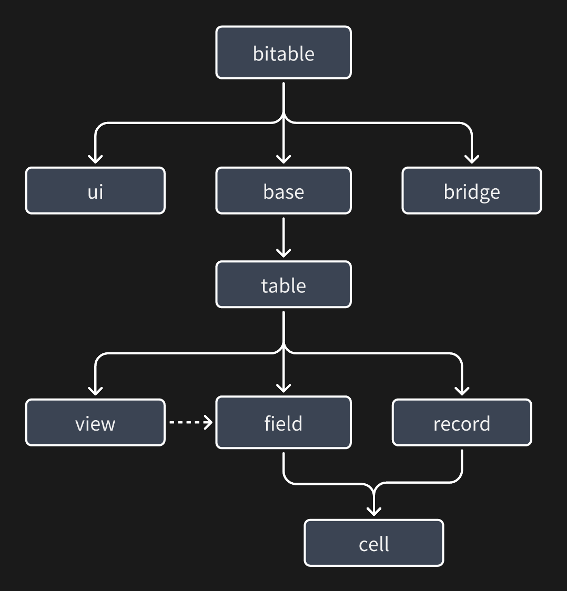
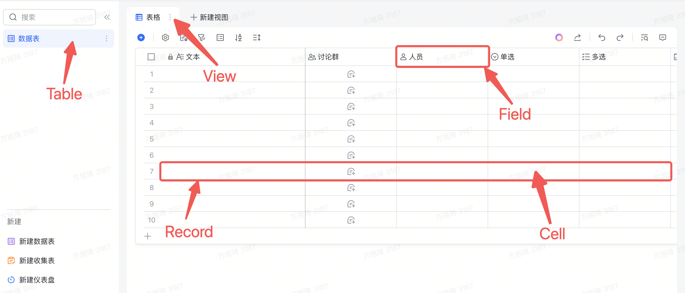

Welcome to the Base JS SDK documentation. In this section, we will introduce how to develop a Base plugin and master 80% of the concepts and core concepts of Base plugin development.
[NPM Address](https://www.npmjs.com/package/@lark-base-open/js-sdk)

Prerequisites:
+ Basic knowledge of front-end development: HTML / CSS / JS
+ [React](https://reactjs.org/) (Students using UI frameworks such as Vue can also create plugins)

Recommended learning:
+ [Typescript](https://www.typescriptlang.org/docs/)

# Core Knowledge

Before we start building the currency conversion plugin, let's first understand the core concepts and related knowledge of multidimensional tables.

The following diagram shows the design model of the API:



``bitable`` is the entry point of the API. Modules like ``base``, ``ui``, ``bridge``, etc. are mounted as properties on it. They can be used as follows:

```typescript 
import { bitable } from '@lark-base-open/js-sdk'
const table = await bitable.base.getActiveTable();
const attachmentFieldList = await table.getFieldListByType<IAttachmentField>(FieldType.Attachment);
```
The modules such as `table`, `field`, etc. can be found in the following diagram:



Let's introduce the concepts of each module:

+ ``base``: The ``base`` module can be understood as a collection of multiple ``tables``. You can use the API to get the corresponding ``table``. It also includes application-level APIs such as file upload.

+ ``table``: The ``table`` module is a collection of data and does not involve the UI display on the page. Its concept is similar to tables in databases: it contains ``fields`` and ``records``. In a multidimensional table, the ``table`` also includes the concept of ``views`` (when obtaining field information at the ``table`` level, it is often unordered because the ``table`` level only contains data and cannot know how it is displayed in the ``views``).

+ ``field``: The ``field`` module contains many different field types, such as ``IAttachmentField`` and the ``ICurrencyField`` we will use later. ``Field`` provides methods for many field operations and setting field properties. For example, it provides a method to add options for multi-select/single-select fields. You can refer to the corresponding API documentation for detailed methods. We also recommend that you start with fields and combine them with ``records`` to perform CRUD operations on data, and get the ``cell`` of a ``table`` or create a ``cell`` using the ``createCell`` method.

+ ``record``: The ``record`` module is mainly used to retrieve data. It can work together with ``field`` to retrieve ``cells``.

+ ``cell``: The ``cell`` module represents a single cell, which is the data of a specific cell in a ``record`` or ``field``. It also supports creating a cell by calling the ``createCell`` method of the ``field``. The created cell can be passed as a parameter when calling ``table.addRecord`` to add a new record. When calling the ``createCell`` method, for the convenience of developers, the data structure is simplified. After the created cell is inserted into the ``table``, it will be automatically associated with a ``record``. After the association, the ``getValue/setValue`` methods of the ``cell`` will be associated with the data of the ``table``, making it real-time.

+ ``view``: The ``view`` module is the view module. Its main purpose is to determine the display method (order/visibility) of ``fields`` and ``records`` in the current view (table view/board view). Therefore, in the ``view`` layer, when retrieving field information/record order of ``fields`` and ``records``, they often match the current display content (when retrieving this information at the ``table`` level, it is often unordered because the ``table`` level cannot determine the display format).

+  ``ui``: The ``ui`` module is responsible for the API of the plugin's display window UI, which is related to the application capabilities of the plugin.

+ ``bridge``: The ``bridge`` module mainly provides application-level interfaces, such as theme switching event notification, etc., which are related to the application capabilities.

Next, let's set up the development environment.