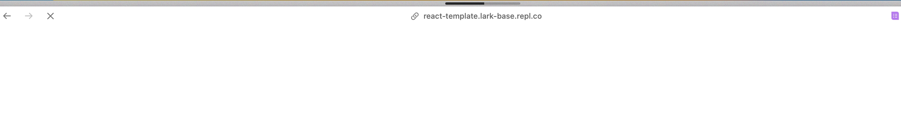

# Setting up the Development Environment

Currently, we provide two development methods for beginners:

1. Development on the Replit website (recommended for beginners)
2. Local editor development (recommended for those with some programming experience)

## Local Development

1. Click [here](https://github.com/Lark-Base-Team/js-sdk-learn-demo) to go to the GitHub repository and fork the repository. Then clone it to your local machine.
2. Follow the instructions in the Readme.md file in the project to run the project. Copy the corresponding URL as prompted, for example, the address shown in the following image:

3. Open or create a Feishu multidimensional table, click on the extension script button, and then click "Add script" to paste the URL copied in step 2. Click "OK" to confirm.

4. After confirming the dialog, the multidimensional table will start loading the corresponding plugin. After loading, it will display the following result:

5. The purpose of this plugin is to get the current table name and display it. Later, we will build a currency conversion plugin based on this basic demo.

## Replit Development

1. Click [here](https://replit.com/@RocketNasa1/js-sdk-learn-demo?v=1) to go to the Replit project.
2. Fork this repository by clicking the "Fork" button in the red box.

3. Enter a desired name and description, and then click "Fork Repl" in the lower right corner.

4. After a while, you will enter the following page. Click the "Run" button at the top, and Replit will start running the project.

5. Then click on the tab as shown in the figure, and then copy the displayed URL. Use it in step 6.
   
   Copy the URL shown below and translate it into English.
   

6. Open or create a Feishu multidimensional table, click on the extension script button, and then click "Add script" to paste the URL copied in step 5. Click "OK" to confirm.

7. After confirming the dialog, the multidimensional table will start loading the corresponding plugin. After loading, it will display the following result. Please note that sometimes the deployment may be slow due to network or other reasons, so please be patient. Once the plugin is officially released, this issue will not occur.

The purpose of this plugin is to get the current table name and display it. Later, we will build a currency conversion plugin based on this basic demo.