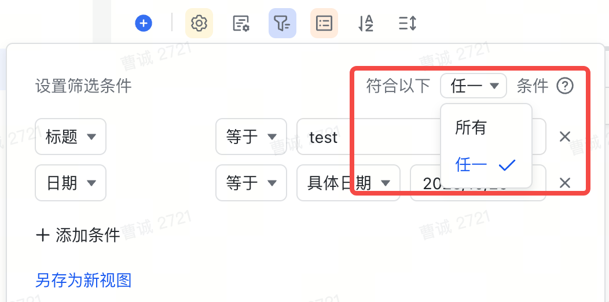
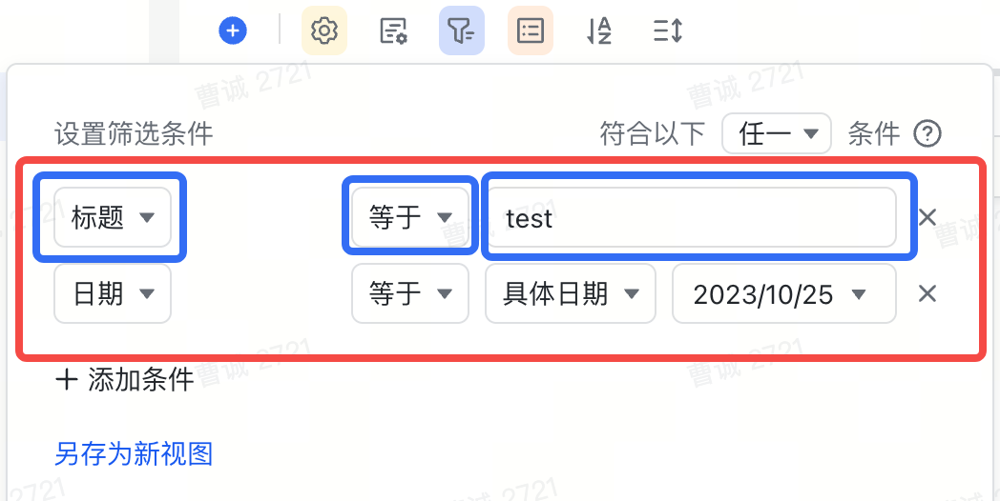

# View 模块

视图 `View` 是数据表 `Table` 的呈现方式（例如字段的展示顺序/记录的显示或隐藏等），一个数据表至少有一个视图，可能有多个视图，每个视图都有唯一标识 viewId，viewId 在一个多维表格中唯一。

::: tip
注意此处与 Table 模块的差异，在 View 模块获取字段/记录的顺序都是**有序**的。
:::

`View` 模块可以在 `Table` 层通过 `getActiveView` 的方式获取

```typescript
const view = await table.getActiveView();
```

View 可以通过下图在得知其在页面中是负责 UI 展示的，因此很多与 UI 展示形式相关的 API 都存在于 View 层，例如筛选/分组/排序等


::: warning
在 View 层很多接口，例如 分组/筛选/排序等，在调用 API 之后如果需要保存或者同步给其他用户需要调用 `view.applySetting` 方法
:::

## 不同类型的视图
目前支持以下 6 种不同类型的视图，不同类型的视图可用能力存在差异：

- [GridView](./view/grid.md)：表格视图
- [KanbanView](./view/kanban.md)：看板视图
- [FormView](./view/form.md)：表单视图
- [GalleryView](./view/gallery.md)：画册视图
- [GanttView](./view/gantt.md)：甘特视图
- [CalendarView](./view/calendar.md)：日历视图

## View 基础类型定义

> 下面是一些基础能力的定义，后续会在 API 涉及到的地方给出指引

### IFilterInfo

```typescript
interface IFilterInfo {
  conjunction: FilterConjunction;
  conditions: FilterInfoCondition[];
}
```

#### FilterConjunction

其中 `FilterConjunction` 代表过滤条件的生效条件，`FilterConjunction.And` 代表符合所有过滤条件，`FilterConjunction.Or` 代表符合任一过滤条件：

```typescript
enum FilterConjunction {
  And = 'and',
  Or = 'or'
}
```



#### FilterInfoCondition

`FilterInfoCondition` 代表过滤条件，**每个 Condition 由`字段` + `过滤操作符` + `匹配值`三个基本元素组成**。



```typescript
interface FilterInfoCondition {
  fieldId: string; // field 唯一标识
  conditionId?: string; // condition 唯一标识，新增时可不传入
  value: FieldValue;  // 字段匹配值
  operator: FilterOperation; // 匹配操作符
}
```

不同的字段可匹配的过滤操作符和匹配值不同，具体类型如下：

|              | IFilterAttachmentCondition                            | IFilterCheckboxCondition | IFilterAutoNumberCondition                                                                                                                                                                                              | IFilterDateTimeCondition                                                                                                        | IFilterCreatedTimeCondition                                                                                                     | IFilterModifiedTimeCondition                                                                                                     | IFilterUserCondition | IFilterCreatedUserCondition | IFilterModifiedUserCondition | IFilterDuplexLinkCondition | IFilterSingleLinkCondition | IFilterFormulaCondition | IFilterGroupChatCondition | IFilterLocationCondition | IFilterLookupCondition | IFilterMultiSelectCondition  | IFilterSingleSelectCondition                                                                                                                                   | IFilterPhoneCondition | IFilterTextCondition | IFilterNumberCondition                                                                                                                                                                                                 | IFilterUrlCondition  | IFilterCurrencyCondition                                                                                                                                                                                               | IFilterBarcodeCondition | IFilterProgressCondition                                                                                                                                                                                               | IFilterRatingCondition                                                                                                                                                                                                 |
| ------------ | ----------------------------------------------------- | ------------------------ | ----------------------------------------------------------------------------------------------------------------------------------------------------------------------------------------------------------------------- | ------------------------------------------------------------------------------------------------------------------------------- | ------------------------------------------------------------------------------------------------------------------------------- | -------------------------------------------------------------------------------------------------------------------------------- | -------------------- | --------------------------- | ---------------------------- | -------------------------- | -------------------------- | ----------------------- | ------------------------- | ------------------------ | ---------------------- | ---------------------------- | -------------------------------------------------------------------------------------------------------------------------------------------------------------- | --------------------- | -------------------- | ---------------------------------------------------------------------------------------------------------------------------------------------------------------------------------------------------------------------- | -------------------- | ---------------------------------------------------------------------------------------------------------------------------------------------------------------------------------------------------------------------- | ----------------------- | ---------------------------------------------------------------------------------------------------------------------------------------------------------------------------------------------------------------------- | ---------------------------------------------------------------------------------------------------------------------------------------------------------------------------------------------------------------------- |
| **operator** | `FilterOperator.IsEmpty \| FilterOperator.IsNotEmpty` | `FilterOperator.Is`      | `FilterOperator.Is \| FilterOperator.IsNot \| FilterOperator.IsGreater \| FilterOperator.IsGreaterEqual \| FilterOperator.IsLess \| FilterOperator.IsLessEqual \| FilterOperator.IsEmpty \| FilterOperator.IsNotEmpty;` | `FilterOperator.Is \| FilterOperator.IsGreater \| FilterOperator.IsLess \| FilterOperator.IsEmpty \| FilterOperator.IsNotEmpty` | `FilterOperator.Is \| FilterOperator.IsGreater \| FilterOperator.IsLess \| FilterOperator.IsEmpty \| FilterOperator.IsNotEmpty` | `FilterOperator.Is  \| FilterOperator.IsGreater \| FilterOperator.IsLess \| FilterOperator.IsEmpty \| FilterOperator.IsNotEmpty` | `BaseFilterOperator` | `BaseFilterOperator`        | `BaseFilterOperator`         | `BaseFilterOperator`       | `BaseFilterOperator`       | `FilterOperator`        | `BaseFilterOperator`      | `BaseFilterOperator`     | `FilterOperator`       | `BaseFilterOperator`         | `FilterOperator.Is \| FilterOperator.IsNot \| FilterOperator.Contains \| FilterOperator.DoesNotContain \| FilterOperator.IsEmpty \| FilterOperator.IsNotEmpty` | `BaseFilterOperator`  | `BaseFilterOperator` | `FilterOperator.Is \| FilterOperator.IsNot \| FilterOperator.IsGreater \| FilterOperator.IsGreaterEqual \| FilterOperator.IsLess \| FilterOperator.IsLessEqual \| FilterOperator.IsEmpty \| FilterOperator.IsNotEmpty` | `BaseFilterOperator` | `FilterOperator.Is \| FilterOperator.IsNot \| FilterOperator.IsGreater \| FilterOperator.IsGreaterEqual \| FilterOperator.IsLess \| FilterOperator.IsLessEqual \| FilterOperator.IsEmpty \| FilterOperator.IsNotEmpty` | `BaseFilterOperator`    | `FilterOperator.Is \| FilterOperator.IsNot \| FilterOperator.IsGreater \| FilterOperator.IsGreaterEqual \| FilterOperator.IsLess \| FilterOperator.IsLessEqual \| FilterOperator.IsEmpty \| FilterOperator.IsNotEmpty` | `FilterOperator.Is \| FilterOperator.IsNot \| FilterOperator.IsGreater \| FilterOperator.IsGreaterEqual \| FilterOperator.IsLess \| FilterOperator.IsLessEqual \| FilterOperator.IsEmpty \| FilterOperator.IsNotEmpty` |
| **value**    | `null `                                               | `boolean \| null`        | `number \| null`                                                                                                                                                                                                        | `IFilterDateTimeValue = number \| FilterDuration  \| null`                                                                      | `number \| FilterDuration \| null`                                                                                              | `number \| FilterDuration \| null`                                                                                               | `string[] \| null`   | `string[] \| null`          | `string[] \| null`           | `string[] \| null`         | `string[] \| null`         | `IFilterAll`            | `string[] \| null`        | `string \| null`         | `IFilterAll`           | `string[] \| null \| string` | `string[] \| string`                                                                                                                                           | `string \| null`      | `string \| null`     | `number \| null`                                                                                                                                                                                                       | `string \| null`     | `number \| null`                                                                                                                                                                                                       | `string \| null`        | `number \| null`                                                                                                                                                                                                       | `number \| null`                                                                                                                                                                                                       |

其中 `FilterOperator` 定义如下：

```typescript
enum FilterOperator {
  /** 等于 */
  Is = 'is',
  /** 不等于 */
  IsNot = 'isNot',
  /** 包含 */
  Contains = 'contains',
  /** 不包含 */
  DoesNotContain = 'doesNotContain',
  /** 为空 */
  IsEmpty = 'isEmpty',
  /** 不为空 */
  IsNotEmpty = 'isNotEmpty',
  /** 大于 */
  IsGreater = 'isGreater',
  /** 大于或等于 */
  IsGreaterEqual = 'isGreaterEqual',
  /** 小于 */
  IsLess = 'isLess',
  /** 小于或等于 */
  IsLessEqual = 'isLessEqual'
}
```

`FilterDuration` 定义如下

```typescript
enum FilterDuration {
  /** 今天 */
  Today = "Today",
  /** 明天 */
  Tomorrow = "Tomorrow",
  /** 昨天 */
  Yesterday = "Yesterday",
  /** 过去7天 */
  TheLastWeek = "TheLastWeek",
  /** 未来7天 */
  TheNextWeek = "TheNextWeek",
  /** 过去30天 */
  TheLastMonth = "TheLastMonth",
  /** 未来30天 */
  TheNextMonth = "TheNextMonth",
  /** 本周 */
  CurrentWeek = "CurrentWeek",
  /** 上周 */
  LastWeek = "LastWeek",
  /** 本月 */
  CurrentMonth = "CurrentMonth",
  /** 上个月 */
  LastMonth = "LastMonth"
}
```

`BaseFilterOperator` 定义如下：

```typescript
type BaseFilterOperator =
  FilterOperator.Is
  | FilterOperator.IsNot
  | FilterOperator.Contains
  | FilterOperator.DoesNotContain
  | FilterOperator.IsEmpty
  | FilterOperator.IsNotEmpty;
```

### ISortInfo

```typescript
interface ISortInfo {
  fieldId: string;
  /** false: 正序 A -> Z;  true: 倒序 Z -> A */
  desc: boolean;
}
```

### IGroupInfo

```typescript
interface IGroupInfo {
  fieldId: string;
  /** false: 正序 A -> Z;  true: 倒序 Z -> A */
  desc: boolean;
}
```

