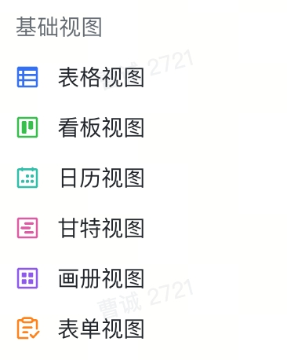

# 视图基础模块



`View` 模块可以在 `Table` 层通过 `getViewById` 的方式获取：
```typescript
const view = await table.getViewById(viewId);
```

上述方法将获取到具体类型的 View 实例，目前支持以下 6 种不同类型的视图：
- [GridView](./grid.md)：表格视图
- [KanbanView](./kanban.md)：看板视图
- [FormView](./form.md)：表单视图
- [GalleryView](./gallery.md)：画册视图
- [GanttView](./gantt.md)：甘特视图
- [CalendarView](./calendar.md)：日历视图

# 基础方法
不同类型的视图可调用的 API 不同，以下是所有视图类型公共的基础方法：

## getName
```typescript
getName(): Promise<string>;
```
获取视图名

## getType
获取视图类型
```typescript
getType(): Promise<ViewType>;
```
其中视图类型的定义如下
```typescript
declare enum ViewType {
  NotSupport = 0,
  Grid = 1,
  Kanban = 2,
  Form = 3,
  Gallery = 4,
  Gantt = 5,
  Calendar = 7,
  WidgetView = 100
}
```

## getMeta
```typescript
getMeta(): Promise<IViewMeta>;
```
获取视图元数据，其中 `IViewMeta` 的类型定义为：
```typescript
interface IViewMeta {
  id: string;
  name: string;
  type: ViewType;
  property: Property;
}
```
其中，`property` 会由不同的视图类型来决定

## getFieldMetaList
```typescript
getFieldMetaList(): Promise<IFieldMeta[]>;
```
获取字段信息的列表，因为 `View` 层涉及到了 `UI` 的展示，所以此时获取的字段信息是有序的

## getVisibleRecordIdList
```typescript
getVisibleRecordIdList(): Promise<(string | undefined)[]>;
```
获取可见记录的 ID 列表

## getVisibleFieldIdList
```typescript
getVisibleFieldIdList(): Promise<string[]>;
```
获取可见字段的 ID 列表

## applySetting
```typescript
applySetting(): Promise<void>;
```
将设置的分组/筛选/排序等视图配置提交，同步给其他用户
