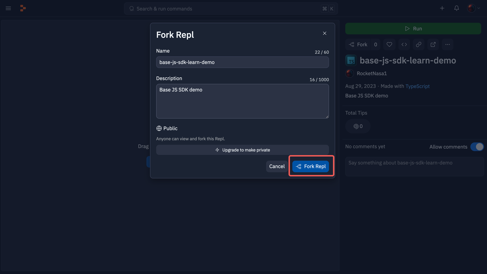
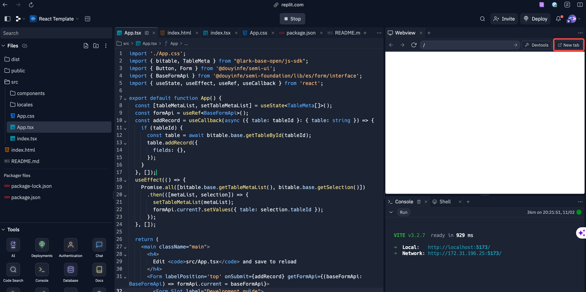
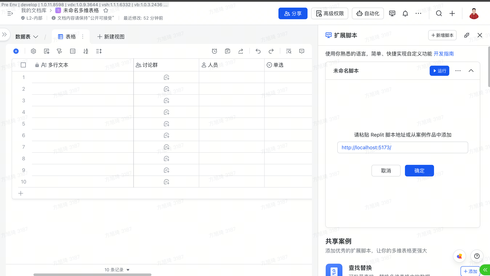

# 快速入门

欢迎来到 Base JS SDK 文档，本章节将为你介绍，如何开发一个 Base 插件，并掌握 Base 插件开发的 80% 概念以及设计的核心概念。

## 旧版本升级方式：
````shell
# npm
npm update @lark-base-open/js-sdk@0.3.0-alpha
# yarn
yarn upgrade @lark-base-open/js-sdk@0.3.0-alpha
# pnpm 
pnpm update @lark-base-open/js-sdk@0.3.0-alpha
````

## 包下载方式
```shell
# npm
npm install @lark-base-open/js-sdk@0.3.0-alpha
# yarn
yarn add @lark-base-open/js-sdk@0.3.0-alpha
# pnpm 
pnpm add @lark-base-open/js-sdk@0.3.0-alpha
```

[NPM 地址](https://www.npmjs.com/package/@lark-base-open/js-sdk)

前置学习：
+ 前端开发基础知识：HTMl / CSS / JS
+ [React](https://react.docschina.org/learn)

推荐学习：
+ [Typescript](https://www.typescriptlang.org/docs/)

## 准备开发环境
目前我们提供两种开发方式给刚刚入门的同学：
1. Replit 官网开发 (推荐新手用户使用)
2. 本地编辑器开发 (推荐有一定编程经验的同学使用)
### Replit 官网开发
1. 点击进入这个 [Replit 项目](https://replit.com/@RocketNasa1/js-sdk-learn-demo?v=1)
2. Fork 这个仓库 (点击红框展示的 Fork 按钮)

3. 输入一个喜欢的名字以及描述，然后点击右下角的 Fork Repl

4. 稍等一会，就可以进入如下所示的页面，此时点击顶部的 Run 按钮，稍等一会，Replit 就会将项目运行起来

5. 此时，右侧会展示一个预览效果，还会有一个 URL 地址，将此 URL 地址复制

6. 打开/新建 一个飞书多维表格，点击此处的扩展脚本按钮

7. 点击新增脚本，将 5 中复制的 URl 粘贴进去，然后点击确定

8. 在完成 7 中的确认弹窗之后，多维表格就会开始加载对应的插件，加载完成之后就会展示如下的效果(有时候会因为网络以及部署等原因，部署较慢，需要耐心等待一下，插件正式上架之后就不会有这样的问题)

这个插件作用是：获取当前的 Table 名称，并展示出来，后面我们基于这个基础 Demo，来实现一个货币转换的插件
### 本地开发
1. 点击进入这个 [Github项目](https://github.com/Lark-Base-Team/js-sdk-learn-demo), Fork 此仓库，并 git clone 到本地
2. 按照项目中 Readme.md 的内容，将项目运行起来，并按照提示复制对应的 URL 例如下图中的地址：


3. 打开/新建 一个飞书多维表格，点击此处的扩展脚本按钮

4. 点击新增脚本，将 5 中复制的 URl 粘贴进去，然后点击确定

5. 在完成 4 中的确认弹窗之后，多维表格就会开始加载对应的插件，加载完成之后就会展示如下的效果

6. 这个插件作用是：获取当前的 Table 名称，并展示出来，后面我们基于这个基础 Demo，来实现一个货币转换的插件
## 核心知识
在开始实现我们的货币转换插件之前，我们先了解一下多维表格的核心概念以及相关知识

下图所示的是 API 的设计模型:


``bitable``是 API 的入口，``base`` 等模块都会作为属性挂载在上面，其中``base``是获取``table``的模块，绝大部分的 API 都是由``table``引申出来的，一般我们会在项目中这样使用:

```typescript 
import { bitable } from '@lark-base-open/js-sdk'
const base = bitable.base;
const table = await base.getActiveTable();
const ui = bitable.ui;
const bridge = bitable.bridge;
```

下面介绍各个模块的概念：

+ ``base``: ``base`` 模块，可以理解为多个 ``table``的集合体，可以通过 API 来获取对应的``table``，其中还有文件上传等 API 应用层面的 API
 
+ ``table``: ``table`` 模块是数据的集合体，不涉及页面上``UI``的展示，其概念和数据库中的表类似:含有``field(字段) record(记录)``，在多维表格中，``table`` 还会含有 ``view(视图)``的概念（在 ``table`` 层面获取字段信息的时候，往往是无序的，因为``table``层面只有数据，无法知晓其在``view(视图)``层面的展示方式）
 
+ ``field``: ``field`` 模块中含有很多不同的字段类型，例如：``IAttachmentField(附件字段)`` 以及后续我们要用到的``ICurrencyField(货币字段)``等，``Field``字段细化了很多字段的操作方法以及设置字段属性的方法，例如为多选/单选字段提供了新增选项的方法，详细方法可以看对应的 API 文档，同时我们也推荐用户从字段入手结合 ``record`` 来对数据进行增删改查，以及获取 ``table`` 的 ``cell`` 或者通过 ``createCell`` 方法来创建一个 ``cell``
 
+ ``record``: ``record`` 模块主要是用来获取数据的，其可以和 ``field`` 共同作用来获取 ``cell`` 

+ ``cell``: ``cell`` 模块是的单元格，是 ``record``/``field`` 中的某一个单元格的数据，同时支持用户通过调用``field``的 ``createCell`` 
方法来创建一个单元格，创建好的单元格可以在 ``table.addRecord`` 时作为参数传入进去，从而新增一条数据，在调用 ``createCell`` 方法时，为了便于开
发者调用，会简化对应的数据结构，创建的单元格被插入到 ``table`` 之后，会与一条 ``record`` 自动关联起来，在与 ``record`` 关联之后，``cell`` 
的 ``getValue/setValue`` 方法就会与 ``table`` 的数据关联起来，从而具有实时性

+ ``view``: ``view`` 模块是视图模块，其最主要的作用就是在当前视图（表格视图/看板视图）决定 ``table`` 中 ``field(字段)/record(记录)`` 的展示方式（顺序/是否可见），因此在 ``view`` 层中，去获取 ``field(字段)/record(记录)`` 的字段信息/记录顺序，往往都是与当前展现的内容相符合的（``table``层去获取这些信息的时候，往往会因为 ``table`` 层无法决定展现形式而无序）
 
+  ``ui``: ``ui`` 模块负责插件展示窗口 UI 的 API，与插件本身的应用能力有关

+ ``bridge``: ``bridge`` 模块主要提供应用层的接口，提供类似主题切换事件通知等插件能力的 API，与 `UI` 模块类似，都与应用能力有关系

接下来，我们来实现一个货币转换的插件

## 实现一个货币转换的插件
在准备好开发环境的基础上，我们来开发一个货币转换插件，首先需要用户先插入一个货币字段，并填充一定的数据

1. 安装完成之后，在 src 目录下新建 ts 文件取名为 ``exchange-api.ts`` 并复制以下内容
```typescript
import axios from 'axios';

interface ExchangeRatesResponse {
  rates: {
    [key: string]: number;
  };
  base: string;
  date: string;
}

export async function getExchangeRate(base: string, target: string): Promise<number | undefined> {
  try {
    const response = await axios.get<ExchangeRatesResponse>(`https://api.exchangerate-api.com/v4/latest/${base}`);
    const rate = response.data.rates[target];

    if (!rate) {
      throw new Error(`Exchange rate not found for target currency: ${target}`);
    }

    return rate;
  } catch (error) {
    console.info(`Error fetching exchange rate: ${(error as any).message}`);
  }
}
```
这部分的代码逻辑是获取实时汇率，``base`` 指的是当前的货币类型 ``target`` 指的是兑换的货币类型，通过这个 API 可以获取保留两位小数的汇率

2. 在 src 目录下新建一个 ts 文件，取名为 ``const.ts``，并将以下内容复制进去
```typescript
import { CurrencyCode } from '@lark-base-open/js-sdk';

export const CURRENCY = [
  { label: 'CNY', value: CurrencyCode.CNY },
  { label: 'USD', value: CurrencyCode.USD },
  { label: 'EUR', value: CurrencyCode.EUR },
  { label: 'AED', value: CurrencyCode.AED },
  { label: 'BRL', value: CurrencyCode.BRL },
  { label: 'CAD', value: CurrencyCode.CAD },
  { label: 'CHF', value: CurrencyCode.CHF },
  { label: 'HKD', value: CurrencyCode.HKD },
  { label: 'INR', value: CurrencyCode.INR },
  { label: 'JPY', value: CurrencyCode.JPY },
  { label: 'MXN', value: CurrencyCode.MXN },
];
```
这个文件是用来枚举可以进行转换的货币类型，因为只做 Demo 展示，所以枚举的数量有限

3. 提供用户选择转换的货币字段能力

首先，货币转换是在原本的字段进行货币值的转换，所以我们需要筛选当前 ``table`` 中的货币类型字段，来让用户进行选择，这里我们在交互上使用 ``Select`` 组件来实现选择这个动作，其中每一个选项都是当前 ``table`` 可以选择的货币字段

我们修改 ``index.tsx`` 中的 ``LoadApp`` 函数：

定义货币字段信息的 `currencyFieldMetaList` 以及选择进行转换的字段 `selectFieldId` 和选择转换的货币类型 `currency`

```typescript
import { bitable } from '@lark-base-open/js-sdk'; //[!code --]
import { bitable, CurrencyCode, FieldType, ICurrencyField, ICurrencyFieldMeta } from '@lark-base-open/js-sdk'; //[!code ++]
import { CURRENCY } from './const'; //[!code ++]

function LoadApp() {
  const [info, setInfo] = useState('get table name, please waiting ....'); // [!code --]
  const [infoType, setInfoType] = useState('info'); // [!code --]
  const [currencyFieldMetaList, setMetaList] = useState<ICurrencyFieldMeta[]>([]) // [!code ++]
  const [selectFieldId, setSelectFieldId] = useState<string>(); // [!code ++]
  const [currency, setCurrency] = useState<CurrencyCode>(); // [!code ++]
```

修改 `useEffect` 函数，在页面完成渲染时获取当前 `table` 内的货币类型字段信息
```typescript
useEffect(() => {
  const fn = async () => {
    const table = await bitable.base.getActiveTable();
    const tableName = await table.getName(); // [!code --]
    setInfo(`The table Name is ${tableName}`); // [!code --]
    setInfoType('success'); // [!code --]
    const fieldMetaList = await table.getFieldMetaListByType<ICurrencyFieldMeta>(FieldType.Currency); // [!code ++]
    setMetaList(fieldMetaList); // [!code ++]
  };
  fn();
}, []);
```
按照顺序，我这里讲解一下用到的相关 API
+ `bitable.base.getActiveTable`: 获取当前的 `table`，获取到了 `table` 之后就可以对数据进行操作
+ `table.getFieldMetaListByType<ICurrencyFieldMeta>(FieldType.Currency)`: 通过字段类型去获取对应的字段信息

然后我们修改渲染的组件，满足用户交互上的需求
```typescript
const formatFieldMetaList = (metaList: ICurrencyFieldMeta[]) => { // [!code ++]
  return metaList.map(meta => ({ label: meta.name, value: meta.id })); // [!code ++]
}; // [!code ++]

return <div>
  <Alert message={info} type={alertType}/> // [!code --]
  <div style={{ margin: 10 }}> // [!code ++]
    <div>Select Field</div> // [!code ++]
    <Select style={{ width: 120 }} onSelect={setSelectFieldId} options={formatFieldMetaList(currencyFieldMetaList)}/> // [!code ++]
  </div> // [!code ++]
  <div style={{ margin: 10 }}>// [!code ++]
    <div>Select Currency</div>// [!code ++]
    <Select options={CURRENCY} style={{ width: 120 }} onSelect={setCurrency}/>// [!code ++]
  </div>// [!code ++]
</div>
```
这个时候，用户已经可以选择字段和想要转换的货币类型了，我们接下来实现转换货币值的逻辑

4. 实现货币转换的逻辑

我们先将获取汇率的 API 引入
```typescript
import { CURRENCY } from './const';
import { getExchangeRate } from './exchange-api'; // [!code ++]
```
然后准备一个转换交互按钮以及转换函数
```typescript
const transform = async () => { // [!code ++]
}// [!code ++]

return <div>
  <div style={{ margin: 10 }}>
    <div>Select Field</div>
    <Select style={{ width: 120 }} onSelect={setSelectFieldId} options={formatFieldMetaList(currencyFieldMetaList)}/>
  </div>
  <div style={{ margin: 10 }}>
    <div>Select Currency</div>
    <Select options={CURRENCY} style={{ width: 120 }} onSelect={setCurrency}/>
    <Button style={{ marginLeft: 10 }} onClick={transform}>transform</Button>// [!code ++]
  </div>
```
接下来实现我们最重要的一步：在 ``transform`` 函数中实现货币字段的货币类型转换以及数值转换
```typescript
const transform = async () => {
  // 如果用户没有选择货币或者转换的字段，则不进行转换操作
  if (!selectFieldId || !currency) return;
  const table = await bitable.base.getActiveTable();
  // 获取货币字段，这里我们传入了一个 ICurrencyField // [!code focus]
  // 来表明我们获取的是一个货币类型的字段  // [!code focus]
  // 在使用 ts 的情况下，我们限制了这个字段的类型之后 // [!code focus]
  // 在开发时就会获得很多类型提示，来帮我们进行开发  // [!code focus]
  const currencyField = await table.getField<ICurrencyField>(selectFieldId); // [!code focus]
  const currentCurrency = await currencyField.getCurrencyCode();
  // 设置货币类型
  await currencyField.setCurrencyCode(currency);
  // 获取货币的汇率
  const ratio = await getExchangeRate(currentCurrency, currency);
  if (!ratio) return;
  // 首先我们获取 recordId 
  const recordIdList = await table.getRecordIdList();
  // 对 record 进行遍历
  for (const recordId of recordIdList) {
    // 获取当前的货币值// [!code focus]
    const currentVal = await currencyField.getValue(recordId);// [!code focus]
    // 通过汇率进行新值的运算// [!code focus]
    await currencyField.setValue(recordId, currentVal * ratio);// [!code focus]
  }
}
```
在上面的例子中，我们在获取字段时传入了对其类型的限制，从而在后续的逻辑中得到了足够的类型提示，这一步非常重要，我们非常推荐开发者用类似的方法来获取字段，
从而提高开发体验。

在修改货币类型时，可以直接调用`CurrencyField.setCurrencyCode`来改变对应的货币类型，这也是得益于在获取对应的字段时我们提供了类型（在这个基础上，需要修改单选/多选字段的选项时，也可以做到类似的效果）
。

在设置货币值的时候，我们用 `CurrencyField.getValue` 来获取对应的数据，然后进行运算，回填的时候，也是调用了 `CurrencyField.setValue`，我们非常推荐
开发者在对值进行增删改查的时候从字段入手，我们细化了非常多的字段类型，从而优化开发者的使用体验（例如附件字段，在 setValue 时支持直接传入文件，来达到设置对应值的目的）。

[货币转换插件完整代码地址](https://github.com/Lark-Base-Team/js-sdk-learn-demo/tree/feat-currency-plugin)

## 发布插件
### Replit 官网开发的插件
1. 点击顶部的项目名称，将会出现 publish 按钮

2. 在填完信息之后，会出现 Publish to Community 按钮，然后点击

3. 会出现 Repl published 的提示，并附带地址，请点击旁边的复制按钮，将这个地址复制下来，会在后一步中用到

4. 在项目设置为 public 之后填写这个[表单](https://bytedance.feishu.cn/share/base/form/shrcnfhuWeBHoWTicKLFybn92Lb)，我们会与最快的速度与您联系，帮助您的插件在应用中正式上架
其中第 8 步复制来的 URl 填入到这一项中：

### 本地开发的插件
1. 首先，本地开发的插件需要用户使用 GitHub 进行管理，并提交代码，然后打开这个链接 [Replit](https://replit.com/~)，完成注册登陆之后，点击 Create Repl

2. 然后点击 Import from Github

3. 选择对应的仓库 (第一次使用的同学这里会展示一个 Github 链接，点击链接进行授权登陆之后就可以了)

4. 点击 Import from GitHub

5. 稍等一会，项目就会成功被导入到 Replit 中，然后输入一个让项目运行的指令（这里默认是 npm run start，replit 没有 pnpm 所以需要用 npm 来启动）

6. 点击顶部的项目名称，将会出现 publish 按钮

7. 在填完信息之后，会出现 Publish to Community 按钮，然后点击

8. 会出现 Repl published 的提示，并附带地址，请点击旁边的复制按钮，将这个地址复制下来，会在后一步中用到

9. 在项目设置为 public 之后填写这个[表单](https://bytedance.feishu.cn/share/base/form/shrcnfhuWeBHoWTicKLFybn92Lb)，我们会与最快的速度与您联系，帮助您的插件在应用中正式上架
其中第 8 步复制来的 URl 填入到这一项中：

## 最后
更多的 API 用法可以点击 [API](api/guide.md) 来查看，在此页面可以通过点击顶部的搜索框来进行 API 的搜索

我们还会不断完善文档，敬请期待。


