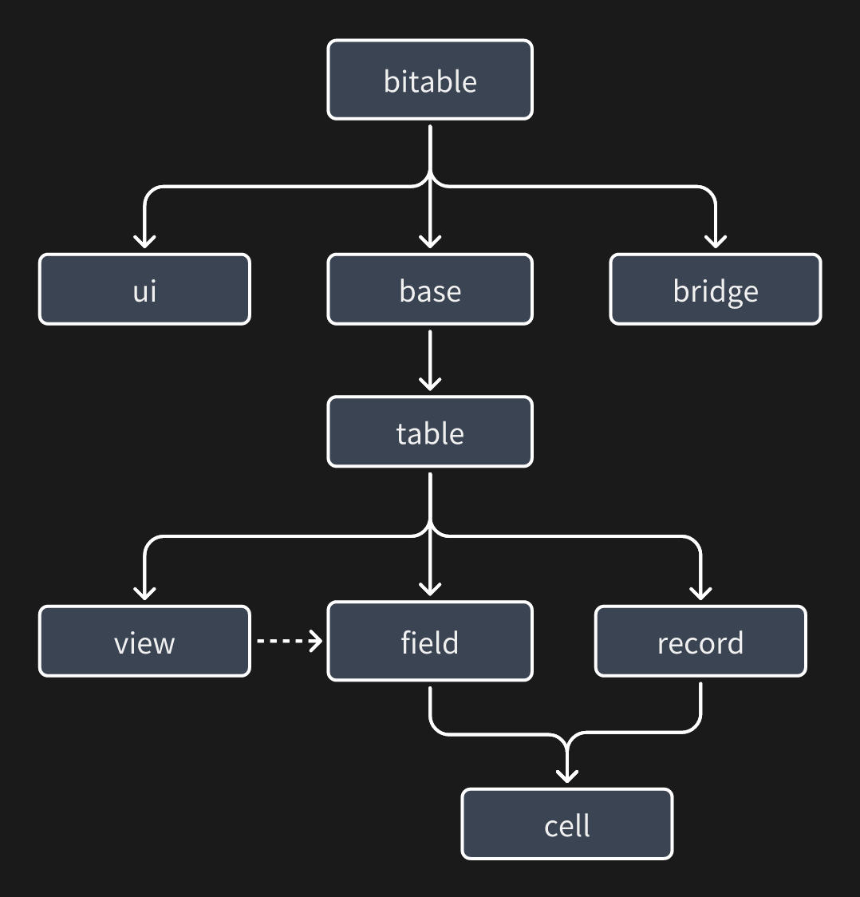

欢迎来到 Base JS SDK 文档，本章节将为你介绍，如何开发一个 Base 插件，并掌握 Base 插件开发的 80% 概念以及设计的核心概念。
[NPM 地址](https://www.npmjs.com/package/@lark-base-open/js-sdk)

前置学习：
+ 前端开发基础知识：HTMl / CSS / JS
+ [React](https://react.docschina.org/learn) (不限定 UI 框架使用 Vue 等框架的同学也可以制作插件)

推荐学习：
+ [Typescript](https://www.typescriptlang.org/docs/)
# 核心知识

我们先了解一下多维表格的核心概念以及相关知识

下图所示的是 API 的设计模型:



``bitable``是 API 的入口，``base`` `ui` `bridge` 等模块都会作为属性挂载在上面，一般会这样使用:

```typescript 
import { bitable } from '@lark-base-open/js-sdk'
const table = await bitable.base.getActiveTable();
const attachmentFieldList = await table.getFieldListByType<IAttachmentField>(FieldType.Attachment);
```
其中，`table` `field` 等模块都都可以在下面这张图中找到对应的关系：


下面介绍各个模块的概念：

+ ``base``: ``base`` 模块，可以理解为多个 ``table``的集合体，可以通过 API 来获取对应的``table``，其中还有文件上传等 API 应用层面的 API

+ ``table``: ``table`` 模块是数据的集合体，不涉及页面上``UI``的展示，其概念和数据库中的表类似:含有``field(字段) record(记录)``，在多维表格中，``table`` 还会含有 ``view(视图)``的概念（在 ``table`` 层面获取字段信息的时候，往往是无序的，因为``table``层面只有数据，无法知晓其在``view(视图)``层面的展示方式）

+ ``field``: ``field`` 模块中含有很多不同的字段类型，例如：``IAttachmentField(附件字段)`` 以及后续我们要用到的``ICurrencyField(货币字段)``等，``Field``字段细化了很多字段的操作方法以及设置字段属性的方法，例如为多选/单选字段提供了新增选项的方法，详细方法可以看对应的 API 文档，同时我们也推荐用户从字段入手结合 ``record`` 来对数据进行增删改查，以及获取 ``table`` 的 ``cell`` 或者通过 ``createCell`` 方法来创建一个 ``cell``

+ ``record``: ``record`` 模块主要是用来获取数据的，其可以和 ``field`` 共同作用来获取 ``cell``

+ ``cell``: ``cell`` 模块是的单元格，是 ``record``/``field`` 中的某一个单元格的数据，同时支持用户通过调用``field``的 ``createCell``
  方法来创建一个单元格，创建好的单元格可以在 ``table.addRecord`` 时作为参数传入进去，从而新增一条数据，在调用 ``createCell`` 方法时，为了便于开
  发者调用，会简化对应的数据结构，创建的单元格被插入到 ``table`` 之后，会与一条 ``record`` 自动关联起来，在与 ``record`` 关联之后，``cell``
  的 ``getValue/setValue`` 方法就会与 ``table`` 的数据关联起来，从而具有实时性

+ ``view``: ``view`` 模块是视图模块，其最主要的作用就是在当前视图（表格视图/看板视图）决定 ``table`` 中 ``field(字段)/record(记录)`` 的展示方式（顺序/是否可见），因此在 ``view`` 层中，去获取 ``field(字段)/record(记录)`` 的字段信息/记录顺序，往往都是与当前展现的内容相符合的（``table``层去获取这些信息的时候，往往会因为 ``table`` 层无法决定展现形式而无序）

+  ``ui``: ``ui`` 模块负责插件展示窗口 UI 的 API，与插件本身的应用能力有关

+ ``bridge``: ``bridge`` 模块主要提供应用层的接口，提供类似主题切换事件通知等插件能力的 API，与 `UI` 模块类似，都与应用能力有关系

接下来，我们搭建开发环境