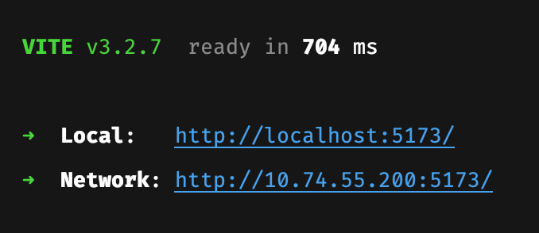
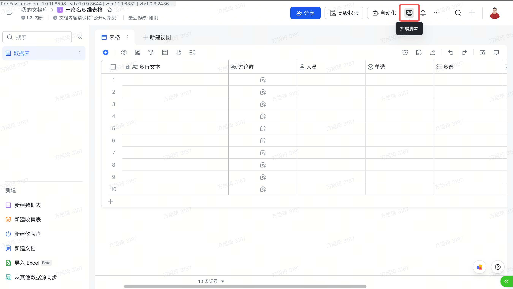
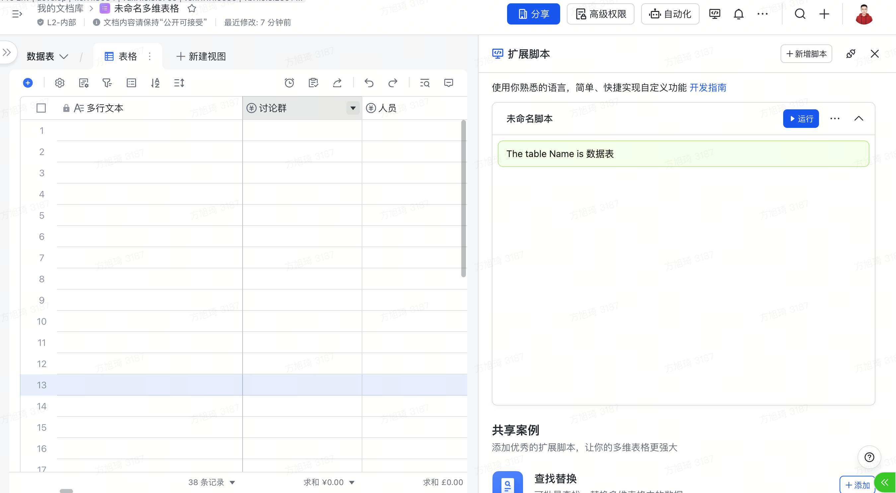
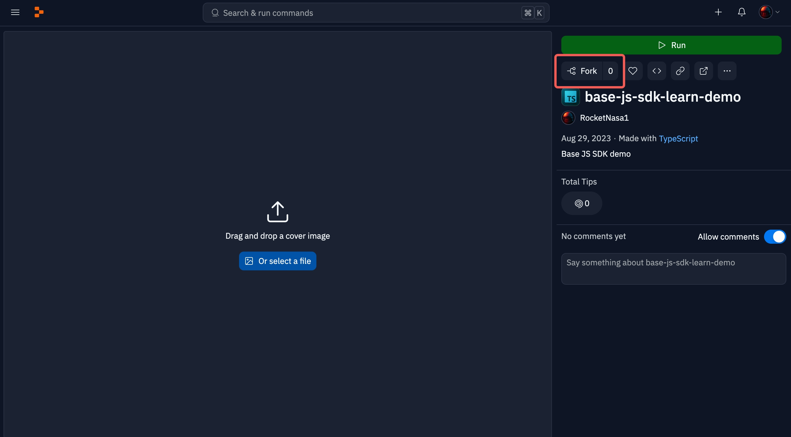
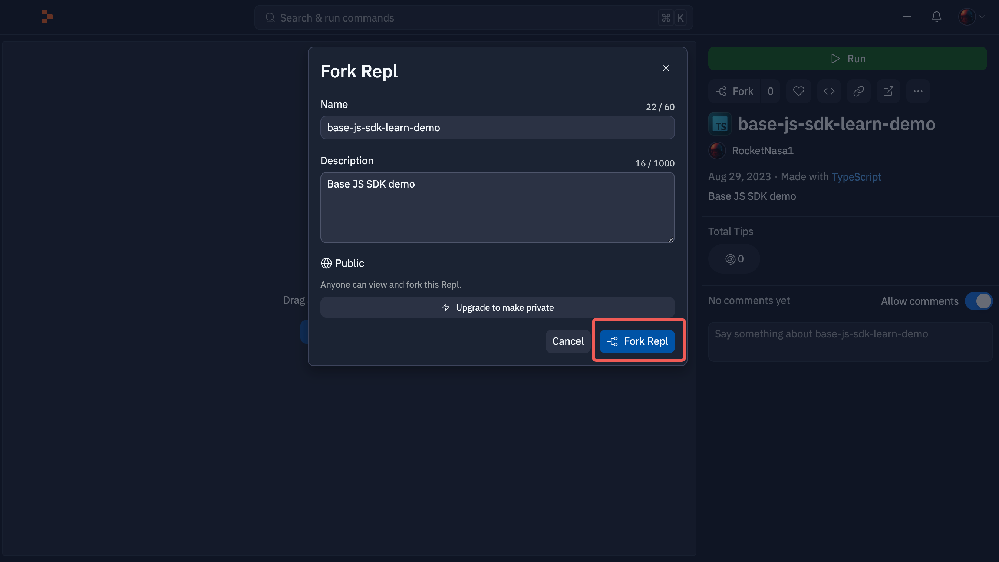
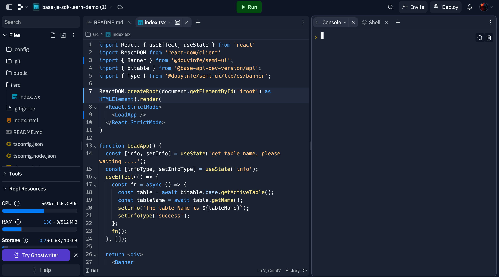
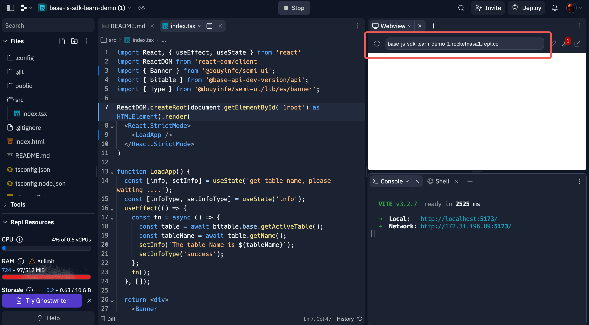
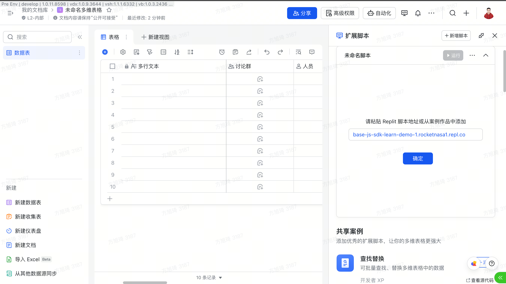

# 准备开发环境
目前我们提供两种开发方式给刚刚入门的同学：
1. Replit 官网开发 (推荐新手用户使用)
2. 本地编辑器开发 (推荐有一定编程经验的同学使用)
## 本地开发
1. 点击进入这个 [Github项目](https://github.com/Lark-Base-Team/js-sdk-learn-demo), Fork 此仓库，并 git clone 到本地
2. 按照项目中 Readme.md 的内容，将项目运行起来，并按照提示复制对应的 URL 例如下图中的地址：

3. 打开/新建 一个飞书多维表格，点击此处的扩展脚本按钮
   
4. 点击新增脚本，将 5 中复制的 URl 粘贴进去，然后点击确定
   
5. 在完成 4 中的确认弹窗之后，多维表格就会开始加载对应的插件，加载完成之后就会展示如下的效果
   
6. 这个插件作用是：获取当前的 Table 名称，并展示出来，后面我们基于这个基础 Demo，来实现一个货币转换的插件
## Replit 官网开发
1. 点击进入这个 [Replit 项目](https://replit.com/@RocketNasa1/js-sdk-learn-demo?v=1)
2. Fork 这个仓库 (点击红框展示的 Fork 按钮)
   
3. 输入一个喜欢的名字以及描述，然后点击右下角的 Fork Repl
   
4. 稍等一会，就可以进入如下所示的页面，此时点击顶部的 Run 按钮，稍等一会，Replit 就会将项目运行起来
   
5. 此时，右侧会展示一个预览效果，还会有一个 URL 地址，将此 URL 地址复制
   
6. 打开/新建 一个飞书多维表格，点击此处的扩展脚本按钮
   
7. 点击新增脚本，将 5 中复制的 URl 粘贴进去，然后点击确定
   
8. 在完成 7 中的确认弹窗之后，多维表格就会开始加载对应的插件，加载完成之后就会展示如下的效果(有时候会因为网络以及部署等原因，部署较慢，需要耐心等待一下，插件正式上架之后就不会有这样的问题)
   
   这个插件作用是：获取当前的 Table 名称，并展示出来，后面我们基于这个基础 Demo，来实现一个货币转换的插件
