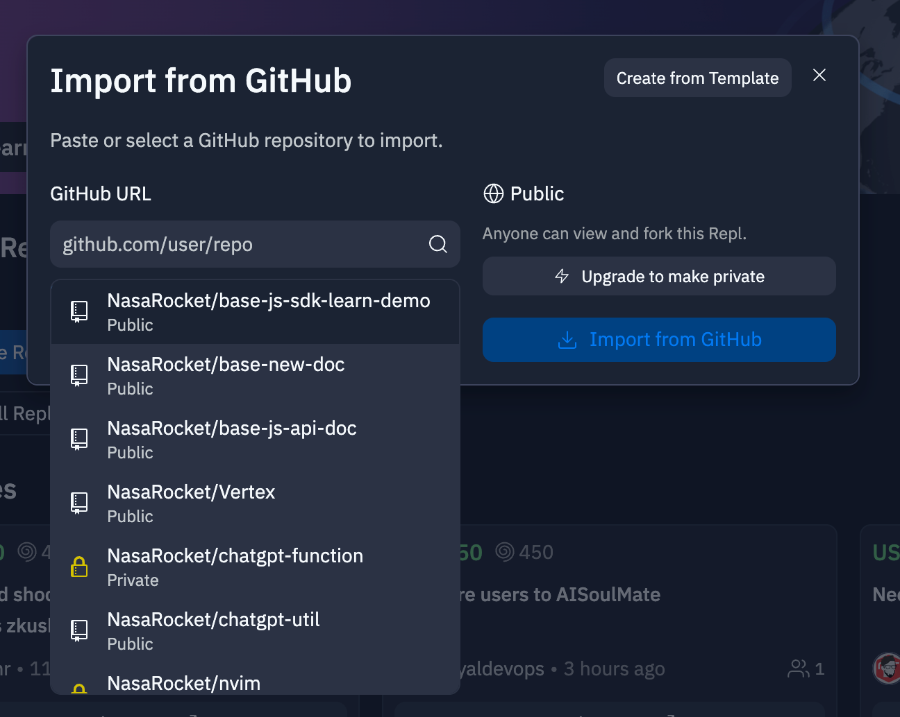
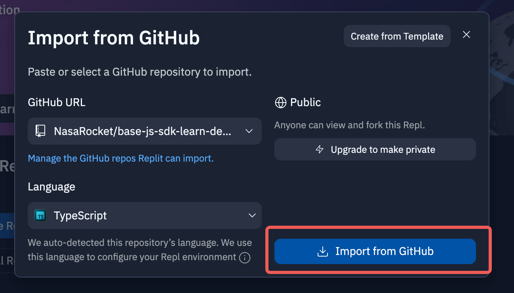
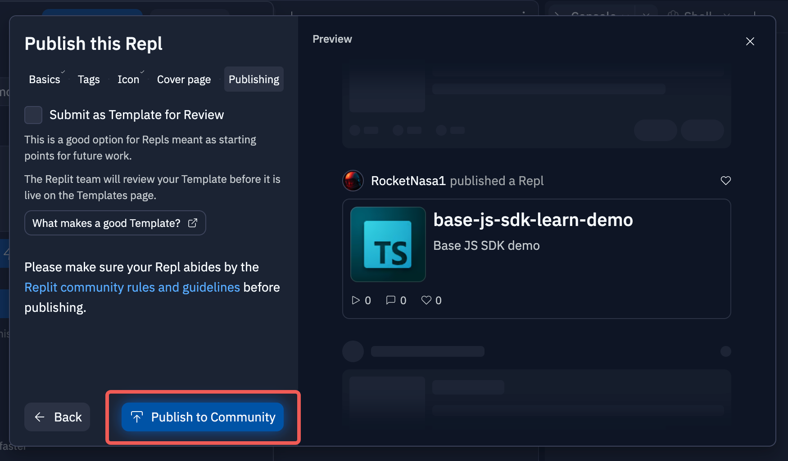

# 发布插件
## 本地开发的插件
1. 首先，本地开发的插件需要用户使用 GitHub 进行管理，并提交代码，然后打开这个链接 [Replit](https://replit.com/~)，完成注册登陆之后，点击 Create Repl
   
2. 然后点击 Import from Github
   
3. 选择对应的仓库 (第一次使用的同学这里会展示一个 Github 链接，点击链接进行授权登陆之后就可以了)
   
4. 点击 Import from GitHub
   
5. 稍等一会，项目就会成功被导入到 Replit 中，然后输入一个让项目运行的指令（这里默认是 npm run start，replit 没有 pnpm 所以需要用 npm 来启动）
   
6. 点击顶部的项目名称，将会出现 publish 按钮
   
7. 在填完信息之后，会出现 Publish to Community 按钮，然后点击
   
8. 会出现 Repl published 的提示，并附带地址，请点击旁边的复制按钮，将这个地址复制下来，会在后一步中用到
   
9. 在项目设置为 public 之后填写这个[表单](https://bytedance.feishu.cn/share/base/form/shrcnfhuWeBHoWTicKLFybn92Lb)，我们会与最快的速度与您联系，帮助您的插件在应用中正式上架
   其中第 8 步复制来的 URl 填入到这一项中：
   
## Replit 官网开发的插件
1. 点击顶部的项目名称，将会出现 publish 按钮
   
2. 在填完信息之后，会出现 Publish to Community 按钮，然后点击
   
3. 会出现 Repl published 的提示，并附带地址，请点击旁边的复制按钮，将这个地址复制下来，会在后一步中用到
   
4. 在项目设置为 public 之后填写这个[表单](https://bytedance.feishu.cn/share/base/form/shrcnfhuWeBHoWTicKLFybn92Lb)，我们会与最快的速度与您联系，帮助您的插件在应用中正式上架
   其中第 8 步复制来的 URl 填入到这一项中：
   